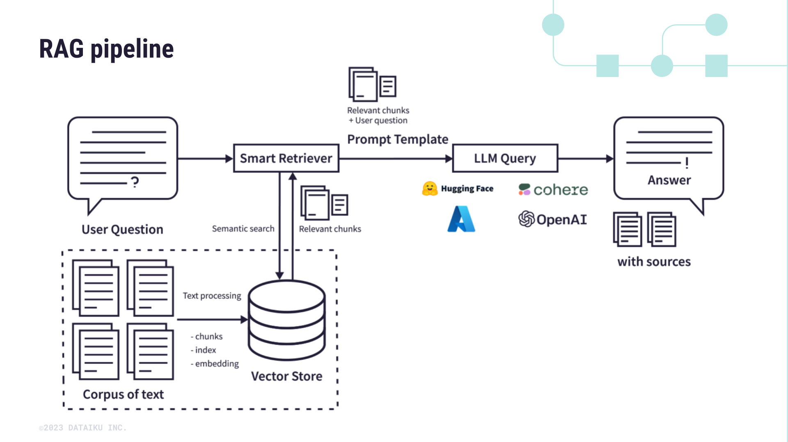

# Práctica 1: Sistema de búsqueda de respuestas
El objetivo de este trabajo es realizar un sistema de búsqueda de respuestas que combine técnicas de recuperación de información (comprensión del lenguaje) con modelos de texto generativo (generación de lenguaje). Este sistema, dado un corpus de documentos, permitirá al usuario realizar una consulta sobre él y obtener una respuesta presente en dicho corpus, que será elaborada por un modelo de lenguaje generativo. En este documento se detallará el proceso de obtencion de los datos.



## Configuracion del entorno de trabajo
Para configurar el entorno necesario para este proyecto, es esencial instalar las bibliotecas listadas en el archivo requirements.txt. Esto se puede hacer ejecutando el siguiente comando en tu terminal:

```pip install -r requirements.txt```

## Obtencion del dataset
El dataset utilizado es [MedQuAD database](https://github.com/abachaa/MedQuAD). Dado que por motivos de copyright se tuvo que eliminar las respuestas a las preguntas de las bases de datos 10, 11 y 12 se ha tenido que obtener dichas respuestas a traves de web scrapping de las webs. Para ello, se ha accedido al repositorio [MedQuAD scraper](https://github.com/glicerico/medquad-scraper) y se ha obtenido los scripts para poder obtener dichos datos. Para generar los documentos con las respuestas adecuadamente formadas se debe realizar los siguientes pasos.   


1) Ejecutar [medquad-scraper/scrape_ADAM.py](/src/scrape_ADAM.py), proporcionando como argumento la ruta al directorio ADAM en el repositorio clonado de MedQuAD (10_MPlus_ADAM_QA):
   
```python medquad-scraper/scrape_ADAM.py dataset/MedQuAD-master/10_MPlus_ADAM_QA```

Esto generará un nuevo directorio `filled_ADAM` que contiene archivos XML con las respuestas obtenidas mediante web scraping. Los archivos XML se procesan en paralelo por defecto.

2) Repite el paso anterior para las otras dos bases de datos faltantes: 
   
    - 11_MPlusDrugs_QA
    
    ```python medquad-scraper/scrape_Drugs.py dataset/MedQuAD-master/11_MPlusDrugs_QA```
    
    - 12_MPlusHerbsSupplements_QA
    
    ```python medquad-scraper/scrape_Herbs.py dataset/MedQuAD-master/12_MPlusHerbsSupplements_QA```
    
3) Convertir los ficheros xml a csv


