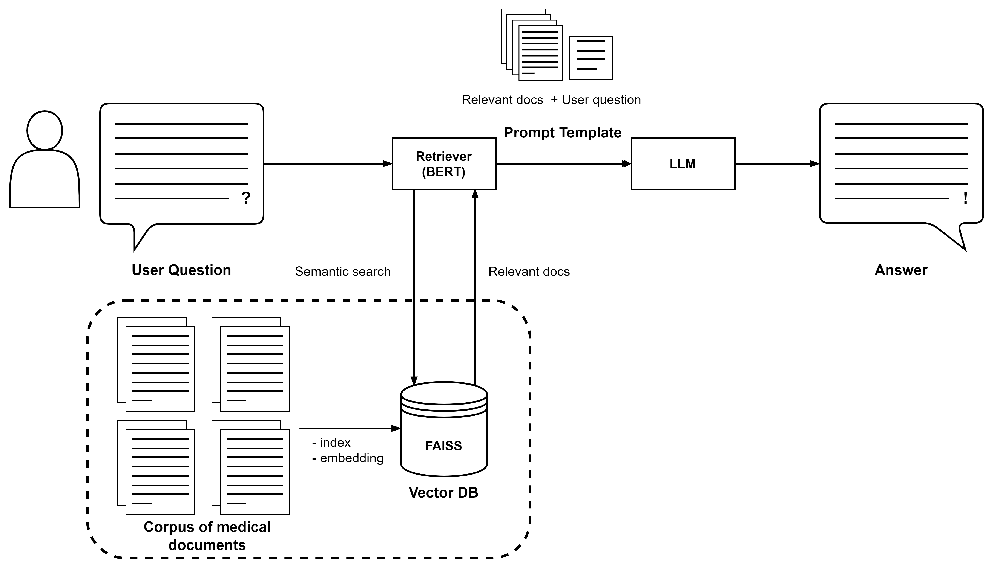
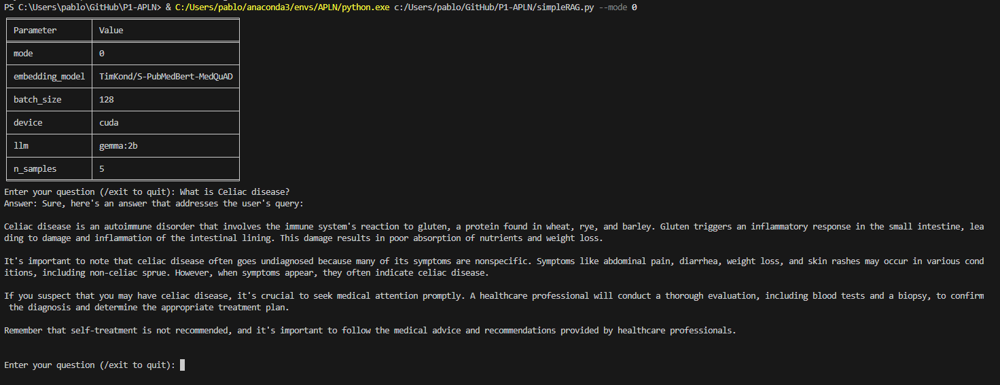
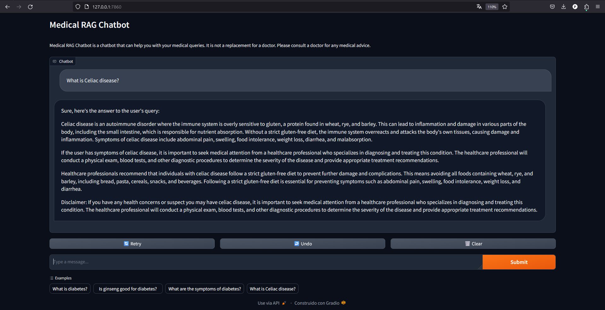

# Práctica 1: Sistema de búsqueda de respuestas
El objetivo de este trabajo es realizar un sistema de búsqueda de respuestas que combine técnicas de recuperación de información (comprensión del lenguaje) con modelos de texto generativo (generación de lenguaje). Este sistema, dado un corpus de documentos, permitirá al usuario realizar una consulta sobre él y obtener una respuesta presente en dicho corpus, que será elaborada por un modelo de lenguaje generativo. En este documento se detallará el proceso de obtencion de los datos.

<!--  -->


## Configuracion del entorno de trabajo
Para configurar el entorno necesario para este proyecto, es esencial instalar las bibliotecas listadas en el archivo requirements.txt. Esto se puede hacer ejecutando el siguiente comando en tu terminal:

```pip install -r requirements.txt```

Además, es necesario tener instalado Ollama. La instalación se puede realizar desde esta web: https://ollama.com/ 

## Obtención del dataset
El dataset utilizado es [MedQuAD database](https://github.com/abachaa/MedQuAD). Dado que por motivos de copyright se tuvo que eliminar las respuestas a las preguntas de las bases de datos 10, 11 y 12 se ha tenido que obtener dichas respuestas a traves de web scrapping de las webs. Para ello, se ha accedido al repositorio [MedQuAD scraper](https://github.com/glicerico/medquad-scraper) y se ha obtenido los scripts para poder obtener dichos datos. Para generar los documentos con las respuestas adecuadamente formadas se debe realizar los siguientes pasos.   


1) Ejecutar [medquad-scraper/scrape_ADAM.py](/src/scrape_ADAM.py), proporcionando como argumento la ruta al directorio ADAM en el repositorio clonado de MedQuAD (10_MPlus_ADAM_QA):
   
```python medquad-scraper/scrape_ADAM.py dataset/MedQuAD-master/10_MPlus_ADAM_QA```

Esto generará un nuevo directorio `filled_ADAM` que contiene archivos XML con las respuestas obtenidas mediante web scraping. Los archivos XML se procesan en paralelo por defecto.

2) Repite el paso anterior para las otras dos bases de datos faltantes: 
   
    - 11_MPlusDrugs_QA
    
    ```python medquad-scraper/scrape_Drugs.py dataset/MedQuAD-master/11_MPlusDrugs_QA```
    
    - 12_MPlusHerbsSupplements_QA
    
    ```python medquad-scraper/scrape_Herbs.py dataset/MedQuAD-master/12_MPlusHerbsSupplements_QA```
    
3) Convertir los ficheros xml a csv


## Modos de Operación

El script `simpleRAG.py` puede operar en dos modos distintos, dependiendo de la preferencia del usuario y el entorno de ejecución. A continuación, se detallan estos modos:

### Modo Terminal

Este modo permite al usuario interactuar con el chatbot a través de la línea de comandos. Es el modo predeterminado y se activa cuando el argumento `--mode` se establece en `0`. Ideal para pruebas rápidas y para entornos donde no se requiere o no está disponible una interfaz gráfica de usuario.



Para ejecutar en modo terminal:
```
python simpleRAG.py --mode 0
```

### Modo GUI

El Modo GUI (Interfaz Gráfica de Usuario) proporciona una experiencia de usuario más amigable, permitiendo interactuar con el chatbot a través de una interfaz visual. Este modo es útil para demostraciones o cuando se prefiere una interacción más intuitiva con el chatbot. Se activa estableciendo el argumento `--mode` en `1`.



Para ejecutar en modo GUI:
```
python simpleRAG.py --mode 1
```

## Uso

Para ejecutar `simpleRAG.py`, utilice el siguiente comando en la terminal. Puede modificar los argumentos según sus necesidades:

```
python simpleRAG.py --mode [MODALIDAD] --llm_model [MODELO_LLM] --embedding_model [MODELO_EMBEDDING] --n_samples [N_MUESTRAS] --batch_size [TAMAÑO_LOTE] --device [DISPOSITIVO]
```

### Argumentos

- `--mode`: Modo de ejecución del script.
  - `0`: Modo consola. Interactúa con el chatbot a través de la línea de comandos.
  - `1`: Modo GUI. Utiliza una interfaz gráfica de usuario para la interacción (si está implementada).
  - `2`: Genera métricas de prueba para evaluar el rendimiento del chatbot.
  - **Predeterminado**: `0`.
- `--llm_model`: Modelo de lenguaje de gran tamaño (LLM) utilizado para generar respuestas.
  - **Predeterminado**: `gemma:2b`.
- `--embedding_model`: Modelo de embedding utilizado para la recuperación de documentos relevantes.
  - **Predeterminado**: `TimKond/S-PubMedBert-MedQuAD`.
- `--n_samples`: Número de documentos relevantes obtenidos en la recuperación.
  - **Predeterminado**: `5`.
- `--batch_size`: Tamaño del lote para el procesamiento de los datos.
  - **Predeterminado**: `128`.
- `--device`: Dispositivo en el que se ejecuta el modelo (`cuda` para GPU, `cpu` para CPU).
  - **Predeterminado**: `cuda`.

